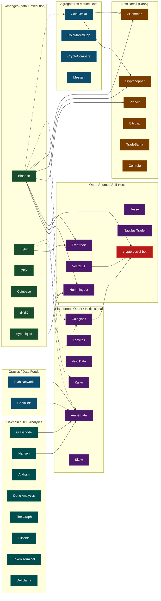
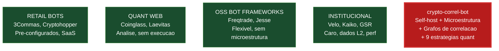
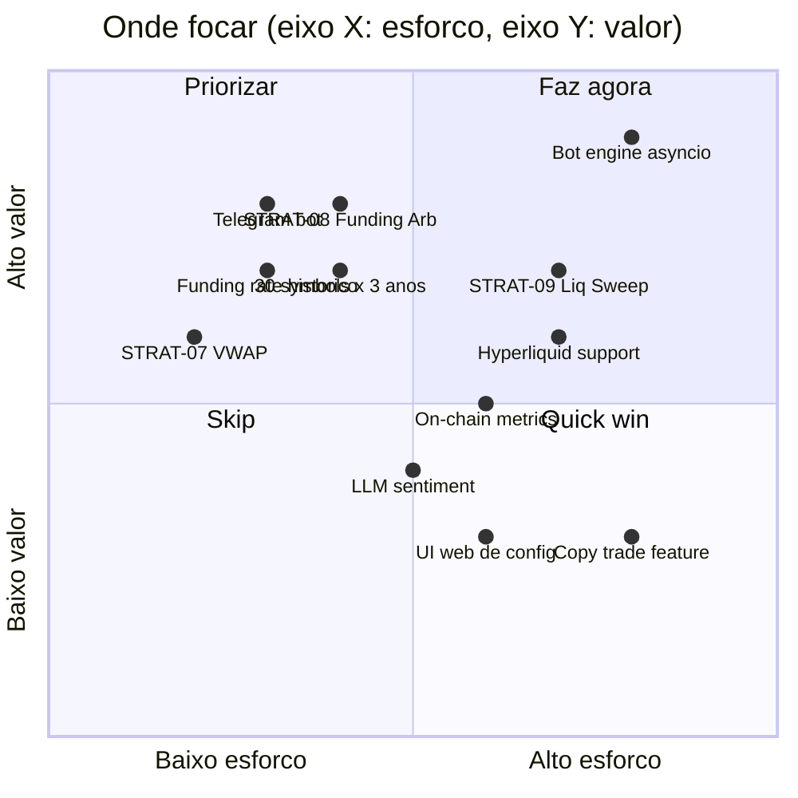

# Panorama do Mercado Cripto-Trading 2026

**Data:** 2026-07-15
**Categoria:** Visao de Mercado

## TL;DR

O ecossistema crypto-trading em 2026 tem tres camadas distintas:
(1) **infraestrutura de dados** (exchanges, oracles, agregadores),
(2) **ferramentas de analise** (bots retail, plataformas quant, on-chain analytics),
(3) **execucao** (bots auto, copy trade, funds algoritmicos).
O crypto-correl-bot se posiciona numa lacuna rara: bot quantitativo "self-hosted"
com microestrutura de nivel institucional, sem custo de API. Quase ninguem oferece
isso no retail. Abaixo, o mapa do mercado e onde estamos.

## Mapa do Ecossistema (Mermaid)

Legenda: setas solidas = integracao direta. Setas tracejadas = feed de dados. **vermelho** = nossa posicao (crypto-correl-bot).

## Camadas do Mercado

### Camada 1: Infraestrutura de dados (base da piramide)

| Tipo | Players | Modelo | Preco |
|---|---|---|---|
| Exchanges CEX | Binance, Bybit, OKX, Coinbase | API + WS free, fee de trade | Free (fee 0.04-0.1%) |
| Exchanges DEX | dYdX, Hyperliquid, Uniswap | On-chain + API | Free (gas) |
| Oracles | Pyth, Chainlink | On-chain price feeds | Free (consumidor) |
| Agregadores spot | CoinGecko, CMC, CryptoCompare, Messari | REST API | Free 30 req/min ou $100-500/mo |
| Agregadores derivativos | Coinglass, Kaiko, Amberdata, Velo, Skew | REST + WS | $100-10000/mo |
| On-chain | Glassnode, Nansen, Arkham, Dune, Flipside | SaaS ou SQL | Free tier + $30-1000/mo |

### Camada 2: Ferramentas de analise (meio da piramide)

| Categoria | Players | Modelo | Preco |
|---|---|---|---|
| Bots retail SaaS | 3Commas, Cryptohopper, Pionex, Bitsgap, TradeSanta, Coinrule | Subscription | $15-100/mes |
| Plataformas quant web | Coinglass, Laevitas, Velo, Amberdata, Skew | Subscription | $30-2000/mes |
| On-chain analytics SaaS | Glassnode, Nansen, Arkham, Token Terminal | Subscription | $30-1000/mes |
| Open-source bots | Freqtrade, Hummingbot, Jesse, Nautilus | Self-host | Free (custo de servidor) |
| Open-source quant libs | VectorBT, Backtrader, zipline, nautilus | Self-host | Free |

### Camada 3: Execucao (topo da piramide)

| Tipo | Players | Modelo | Preco |
|---|---|---|---|
| Bots auto retail | 3Commas, Pionex, Freqtrade self-hosted | SaaS ou self | $15-100/mes ou free |
| Copy trade | eToro, Bybit Copy, Binance Lead Traders | Fee de performance | 10-30% profit share |
| Funds algoritmicos | Jump, Wintermute, Cumberland, GSR | Prop | N/A (institutional) |
| Market making | Hummingbot self-hosted, GSR, Wintermute | Self ou outsourced | Varia |

## Onde o crypto-correl-bot se posiciona

### Lacuna de mercado que ocupamos

O cruzamento "self-hosted + microestrutura + estrategias quant combinaveis"
tem poucos competidores diretos. A tabela abaixo mostra o que cada categoria oferece:

| Feature | Retail SaaS | Quant Web | OSS Bot Frameworks | Institucional | **crypto-correl-bot** |
|---|---|---|---|---|---|
| Self-hosted | Nao | N/A | Sim | N/A | **Sim** |
| Custo mensal | $15-100 | $30-2000 | $0 (server) | $500+ | **$0** |
| Order book L2 real-time | Nao | Sim (read) | Alguns | Sim | **Sim** |
| Funding rate / OI / liquidations | Alguns | Sim (read) | Poucos | Sim | **Sim** |
| Microestrutura metrics (Kyle, Amihud, VPIN) | Nao | Sim (read) | Nao | Sim | **Sim** |
| Grafos de correlacao | Nao | Poucos | Nao | Sim | **Sim** |
| Estrategias quant combinaveis (meta-filter) | Nao | N/A | Poucos (FreqAI) | Sim | **Sim (5/9)** |
| Backtest walk-forward | Nao | N/A | Sim | Sim | **Sim** |
| Regime detection (HMM, Hurst) | Nao | Poucos | Nao | Sim | **Sim** |
| Dashboard cientifico HTML | Nao | Sim | Nao | Sim | **Sim** |
| Execucao automatica | Sim | Nao | Sim | Sim | **Nao ainda (Fase 4-5)** |
| Telegram alerts | Sim | Alguns | Sim (Freqtrade) | N/A | **Nao ainda** |
| Copy trade | Sim | Nao | Nao | Nao | **Nao** |

### Onde estamos bem

- Stack quant completa (sem paying Coinglass $100/mes para ver OI/funding).
- Visualizacao nivel Bloomberg Terminal (analyze_live.py).
- Dados desde 2017 via Binance Vision, sem rate limit para historico.
- 9 estrategias documentadas, 5 implementadas.
- Backtest rigoroso com walk-forward.
- 100% open-source (sem vendor lock-in).

### Onde temos gap

- **Sem execucao automatica** (Fase 4-5 pendente). Este e o gap mais critico: hoje o bot analisa mas nao opera.
- **Sem Telegram / monitoramento 24/7** (precisa para producao).
- **Sem dados historicos de funding rate, OI, liquidations** (so real-time). Para backtest de STRAT-08 (funding arb) e STRAT-09 (liquidity sweep), precisamos de historico desses dados.
- **Sem dados de order book L2 historico** (so real-time). Para backtest de STRAT-05 (volume profile) e analise de microestrutura historica.
- **Escala de dados**: 10 symbols, 6 meses. Para backtest robusto precisa 30+ symbols, 3+ anos.
- **Sem UI de config** (tudo via CLI/YAML). Retail gosta de UI.
- **Sem comunidade / documentacao de usuario final**. E um projeto pessoal, nao um produto.

## Onde o mercado esta indo em 2026

Tendencias observadas no ecossistema (consolidar com pesquisa dos subagentes):

1. **DEX崛起**: Hyperliquid, dYdX ganhando volume. Trading on-chain sem KYC, sem risco de exchange CEX. Tendencia: bots que suportam CEX + DEX ganham relevancia (Hummingbot ja faz).

2. **AI agents em trading**: LLMs para sentiment analysis em Twitter/news. Agentes autonomos (Devin, Manus). FreqAI em Freqtrade. Hype alto, resultados modestos documentados em benchmarks publicos.

3. **Tokenizacao de ativos reais (RWA)**: Treasuries, stocks, real estate em chain. Abre nova classe de ativos descorrelacionada de cripto nativo.

4. **On-chain data como alpha**: Glassnode, Nansen, Dune sao mais usados por quant desks. Tecnica classica (TA) perdendo espaco para on-chain + microestrutura.

5. **Institucionalizacao**: ETFs BTC/ETH nos EUA, regualcao MiCA na EU, regras mais claras em varios paises. Traz mais volume institucional e menos volatilidade selvagem.

6. **Morte do "signal-selling"**: Comunidades Discord/Telegram vendendo "sinais" em declinio, usuarios migrando para bots auto-transparentes (Freqtrade, 3Commas com backtest visivel).

7. **APIs mais rigorosas**: Binance apertando KYC para futures em 2024-2025. Some endpoints geo-blocked. Bybit ganhando market share de API users.

## Matriz de oportunidade

## Roadmap recomendado (baseado em gap + mercado)

| Prioridade | Item | Esforco | Valor | Justificativa |
|---|---|---|---|---|
| P0 | Bot engine + risk_manager + paper_broker | Alto | Alto | Sem isso o projeto nao e um "bot", e um analyzer |
| P0 | Telegram notifications | Baixo | Alto | Monitoramento essencial para producao |
| P1 | Funding rate historico (Binance Vision tem monthly) | Baixo | Alto | Desbloqueia STRAT-08 |
| P1 | STRAT-08 (Funding Arb) + STRAT-07 (VWAP) | Medio | Alto | Estrategias delta-neutral + simple, estaveis |
| P1 | Dados 30 symbols x 3 anos x 5m | Medio | Alto | Backtest robusto |
| P2 | STRAT-09 (Liquidity Sweep) + STRAT-02 (Price Action) | Medio | Medio | Mais sinais, mas subjetivos |
| P2 | Order book L2 historico (Hyperliquid DAO tem) | Medio | Medio | Backtest de microestrutura |
| P3 | Hyperliquid support (via CCXT ou API nativa) | Medio | Medio | Tendencia DEX, sem KYC, sem block BR |
| P3 | Config YAML estruturado | Baixo | Medio | Operacao production-grade |
| P4 | LLM sentiment analysis | Medio | Baixo | Hype > resultado, por enquanto |
| P4 | UI web de config | Alto | Baixo | Freqtrade ja tem, nao e nosso diferencial |

## Conclusao

O crypto-correl-bot ja tem a "camada cerebral" (analise + estrategias + backtest)
no nivel de ferramentas quant pagas. Falta a "camada muscular" (execucao +
monitoramento). Quando Fase 4-5 estiverem prontas, sera um dos poucos projetos
self-hosted com microestrutura + grafos + multi-estrategia. O mercado
retail SaaS esta estagnado em "grid bot + DCA bot", o que da espaço para
stacks mais sofisticados abertos. A ameaca real nao sao os bots SaaS, sao
os frameworks open-source (Freqtrade, Jesse) que podem adicionar
microestrutura no futuro. Vantagem competitiva hoje: time-to-market de
features de microestrutura + nossa velocidade de iteracao (sem vendor lock).
