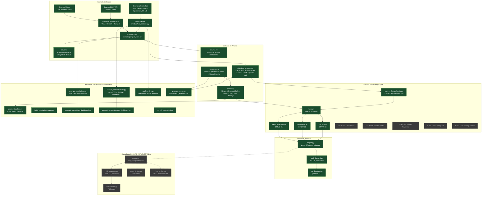
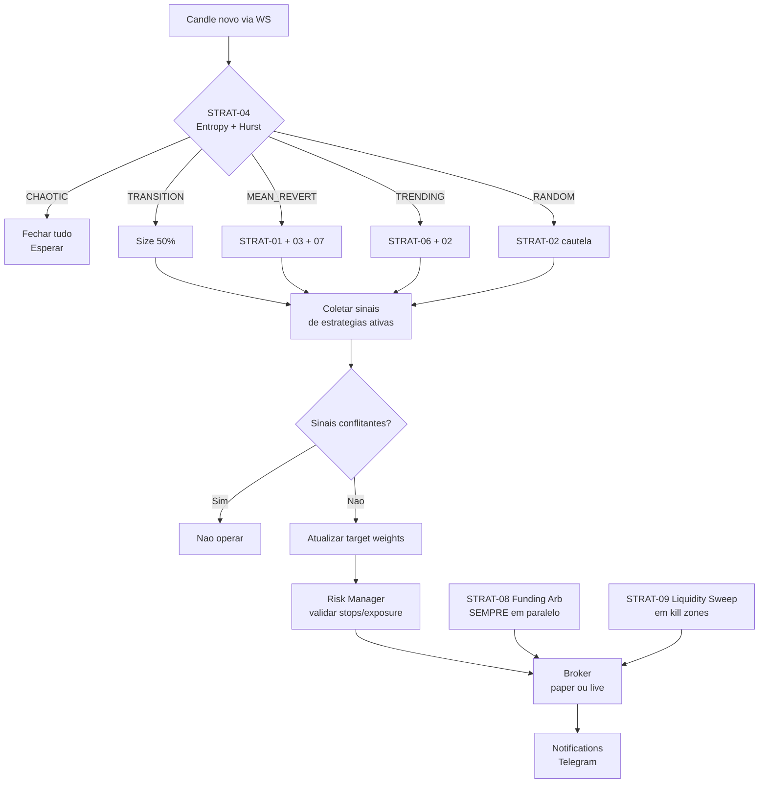

# Sistema crypto-correl-bot: Visao Completa

**Data:** 2026-07-15
**Status:** Fase 0, 1, 2, 2.5 concluidas. Fase 3 (backtest) em andamento. Fases 4 e 5 (paper/live) planejadas.

## TL;DR

O crypto-correl-bot e um sistema quantitativo de trading em cripto que combina:
grafos de correlacao entre ativos, analise de microestrutura de mercado em tempo
real, e um portifolio de 9 estrategias. Hoje ele ja coleta dados da Binance,
constroi grafos, gera dashboards cientificos em HTML, mas ainda nao opera sozinho
em producao. O organograma abaixo mostra tudo que existe (verde) e tudo que falta
(cinza).

## Organograma do Sistema (Mermaid)



Legenda: **verde** = implementado e testado. **cinza tracejado** = planejado, ainda nao existe.

## Organograma ASCII (alternativa, para viewers sem Mermaid)

```
                        +-------------------------------+
                        |        CAMADA DE DADOS        |
                        +-------------------------------+
                                    |
   +----------+   +----------+   +-----------+   +-----------+
   | Binance  |   | Binance  |   | Binance   |   |           |
   | Vision   |   | REST API |   | WebSocket |   |  (none)   |
   | (CSV)    |   | (klines) |   | (realtime)|   |           |
   +----+-----+   +----+-----+   +-----+-----+   +-----+-----+
        |              |               |               |
        v              v               v               v
   +----+-----+   +----+-----+   +-----+-----+
   | download |   | download |   |  Live     |
   | historical|  | historical|  | Collector |
   +----+-----+   +----+-----+   +-----+-----+
        |              |               |
        +------+-------+-------+-------+
               |
               v
        +--------------+        +--------------+
        | ParquetStore | <----> |   Universe   |
        |  (parquet)   |        |  25 symbols  |
        +------+-------+        +--------------+
               |
               v
   +-------------------------------+-------------------------------+
   |        CAMADA DE ANALISE      |     CAMADA DE ESTRATEGIA      |
   +-------------------------------+-------------------------------+
   |  returns -> correlation       |  base (interface)             |
   |     -> graph (NetworkX)       |     |                         |
   |  statistical_analyzer:        |     +-- mean_reversion (01)   |
   |     ADF, KPSS, Hurst,         |     +-- momentum (06)         |
   |     half-life, GARCH,         |     +-- stat_arb (03)         |
   |     HMM, ruptures, VaR        |     +-- regime_filter (04)    |
   +---------------+---------------+     +-- [ ] price_action (02) |
                   |                       +-- [ ] volume_profile  |
                   |                       +-- [ ] vwap (07)        |
                   |                       +-- [ ] funding_arb (08) |
                   |                       +-- [ ] liq_sweep (09)   |
                   |                       +---------------+--------+
                   |                                       |
                   v                                       v
   +-------------------------------+      +-------------------------------+
   |     CAMADA DE BACKTEST        |      |     CAMADA DE BOT [TODO]      |
   +-------------------------------+      +-------------------------------+
   |  engine (VectorBT)            |      |  engine (asyncio loop) [ ]    |
   |  walk_forward (IS/OOS)        |      |  risk_manager [ ]             |
   |  run_backtest.py              |      |  paper_broker [ ]             |
   +---------------+---------------+      |  live_broker (CCXT) [ ]       |
                   |                      |  notifications (Telegram) [ ] |
                   |                      +---------------+---------------+
                   v                                      |
   +-------------------------------+                      |
   |  CAMADA DE VISUALIZACAO       |                      |
   +-------------------------------+                      |
   |  graph_visualizer (Pyvis)     |                      |
   |  build_correlation_graph.py   |                      |
   |  analyze_correlations.py      |                      |
   |  analyze_microstructure.py    |                      |
   |  analyze_live.py (terminal)   |                      |
   |  generate_*_dashboard.py      |                      |
   |  generate_report.py           |                      |
   |  refresh_dashboard.py         |                      |
   +-------------------------------+                      |
                                                        |
                                                        v
                                              +-------------------+
                                              |  PRODUCAO LIVE    |
                                              |  (Fase 5, $50-100) |
                                              |  [ ] NAO EXISTE   |
                                              +-------------------+
```

## O que o sistema JA faz hoje

### 1. Coleta de dados (totalmente funcional)

- **Historico**: 10 symbols (BTCUSDT, ETHUSDT, SOLUSDT, BNBUSDT, XRPUSDT, ADAUSDT, DOTUSDT, AVAXUSDT, DOGEUSDT, LINKUSDT), 2 timeframes (1d, 1h), 6 meses (Jan-Jun 2024), 45.500 candles em 120 arquivos Parquet. Validado contra API live.
- **Tempo real**: LiveCollector captura WebSocket de order book (depth20@100ms), trades (aggTrade), funding rate (markPrice@1s), liquidations (!forceOrder). REST polling de open interest (30s) e long/short ratio (60s). Storage em Parquet particionado por data.
- **Universo**: 25 symbols USDT default, filtros por volume medio diario > $10M e historico pre-2022.

### 2. Analise de correlacao e grafos (totalmente funcional)

- Calculo de log-returns e simple-returns com alinhamento multi-asset.
- Matriz de correlacao Pearson, Spearman, Kendall com janela deslizante.
- Construcao de grafo NetworkX: 10 nodes, 40 edges, densidade 0.89.
- Deteccao de comunidades (greedy modularity): 2 clusters (large caps vs mid/meme caps).
- Metricas: density, centrality, betweenness, clustering coefficient.
- Visualizacao HTML interativo via Pyvis.

### 3. Analise estatistica e de microestrutura (totalmente funcional)

- `statistical_analyzer.py`: ADF, KPSS, Hurst (nolds), half-life, GARCH (arch), HMM (GaussianMixture), structural breakpoints (ruptures), VaR/CVaR historico, drawdowns, normalidade (Jarque-Bera, Shapiro).
- `analyze_microstructure.py`: taker buy/sell ratio, gap analysis, wick analysis, volume profile, round-number clustering, order flow imbalance, price magnetism, candle anatomy, accumulation/distribution.
- `analyze_correlations.py`: return correlations, lagged correlations, time-of-day patterns, volatility correlations, volume correlations, drawdown correlations, regime correlations, cross-asset momentum, category correlations, movement following.
- `analyze_live.py`: terminal cientifico em tempo real com 40+ metricas por symbol (RSI, MACD, Bollinger, VWAP, SuperTrend, Fibonacci, CVD, Kyle's Lambda, Amihud, VPIN, POC/VAH/VAL, funding, OI, L/S, regime HMM, breakpoints).

### 4. Estrategias e backtest (parcialmente funcional)

- **Implementadas (5 de 9)**: base.py, mean_reversion (STRAT-01), momentum (STRAT-06), stat_arb (STRAT-03), regime_filter/meta (STRAT-04).
- **Nao implementadas (4 de 9)**: STRAT-02 (Price Action), STRAT-05 (Volume Profile), STRAT-07 (VWAP), STRAT-08 (Funding Arb), STRAT-09 (Liquidity Sweep).
- Backtest engine com VectorBT, walk-forward analysis, custos (0.1% taker, 0.075% maker), slippage model.
- 52 testes unitarios passando (pytest), cobertura de todos os modulos implementados.

### 5. Dashboards e relatorios (totalmente funcional)

- `data/graphs/correlation_graph_pearson_threshold_0.5_(10_assets).html` (Pyvis).
- `data/analysis/correlation_dashboard.html`, `microstructure_dashboard.html`, `microstructure_dashboard_1h.html`.
- `data/live/dashboard.html` (terminal cientifico em tempo real, auto-refresh 10s).
- `data/live/SCIENTIFIC_REPORT.md` (580 linhas, relatorio por symbol com 40+ metricas).

## O que o sistema NAO faz ainda (gaps)

### Backtest

- Faltam 5 estrategias implementadas (STRAT-02, 05, 07, 08, 09).
- Falta backtest combinado com meta-filtro (STRAT-04 selecionando regime).
- Falta validacao do criterio de saida: Sharpe OOS >= 1.5, PF >= 3.0.

### Bot em producao (Fase 4 e 5, totalmente ausente)

- Sem `src/bot/` directory. Sem loop principal asyncio.
- Sem risk_manager (stop loss, max DD diario, kill switch).
- Sem paper_broker (simulador de execucao).
- Sem live_broker (CCXT execucao real).
- Sem notifications (Telegram bot, /status, /stop).
- Sem monitoramento 24/7 (systemd service).

### Infraestrutura de producao

- Sem config YAML estruturado (hardcoded em scripts).
- Sem structured logging (JSON com correlation ID).
- Sem Redis para estado em tempo real (planejado no ARCHITECTURE.md).
- Sem Grafana / ClickHouse para monitoramento (Fase 6).

### Escala de dados

- 10 symbols hoje, meta 30+ symbols.
- 6 meses hoje, meta 3+ anos (2021-2024 cobrindo bull, bear, lateral).
- 5m timeframe recomendado (compromisso granularidade/volume), so 1d e 1h hoje.
- Sem dados de funding rate historico (so em tempo real).
- Sem dados de order book L2 historico (so real-time via WS).

## Matriz de capacidades vs metas

| Capacidade | Status | Cobre a meta? | Gap |
|---|---|---|---|
| Coleta historica OHLCV | PRONTO | Parcial | 10/30 symbols, 0.5/3 anos, 1d+1h/5m |
| Coleta tempo real (WS+REST) | PRONTO | Sim | - |
| Calculo de returns + correlacao | PRONTO | Sim | - |
| Construcao de grafo de correlacao | PRONTO | Sim | - |
| Deteccao de comunidades | PRONTO | Sim | - |
| Visualizacao HTML interativa | PRONTO | Sim | - |
| Analise estatistica (ADF, Hurst, GARCH) | PRONTO | Sim | - |
| Analise de microestrutura (order flow) | PRONTO | Sim | - |
| Estrategias implementadas | PARCIAL | 5/9 | Faltam STRAT-02, 05, 07, 08, 09 |
| Backtest engine + walk-forward | PRONTO | Sim | Falta backtest combinado |
| Testes unitarios | PRONTO | 52 tests | - |
| Dashboard cientifico em tempo real | PRONTO | Sim | - |
| Relatorio cientifico auto-gerado | PRONTO | Sim | - |
| Loop do bot (asyncio) | FALTA | Nao | Todo `src/bot/` |
| Risk manager | FALTA | Nao | - |
| Paper broker | FALTA | Nao | - |
| Live broker (CCXT) | FALTA | Nao | - |
| Telegram notifications | FALTA | Nao | - |
| Monitoramento 24/7 | FALTA | Nao | - |
| Config YAML estruturado | FALTA | Nao | - |
| Structured logging | FALTA | Nao | - |
| Redis para estado real-time | FALTA | Nao | - |
| Trading real ($50-100) | FALTA | Nao | Fase 5 |

## Fluxo de decisao (alvo futuro, quando bot existir)



## Componentes por linha de codigo

| Camada | Linhas src/ | Linhas scripts/ | Total | Status |
|---|---:|---:|---:|---|
| Data | 724 | 429 | 1.153 | Estavel |
| Analysis | 277 | 0 | 277 | Estavel |
| Strategy | 1.285 | 0 | 1.285 | Em desenvolvimento |
| Backtest | 481 | 230 | 711 | Em desenvolvimento |
| Viz | 108 | 2.353 | 2.461 | Estavel |
| Bot | 0 | 0 | 0 | Nao iniciado |
| **Total** | **2.875** | **6.309** | **9.184** | - |

## Como operar o sistema hoje

```bash
cd /home/lucas/Projetos/crypto-correl-bot
source .venv/bin/activate

# 1. Baixar historico
python scripts/download_historical.py --symbols BTCUSDT,ETHUSDT --start 2024-01-01 --end 2024-06-30 --timeframe 1d

# 2. Coletar tempo real (precisa rodar em background)
python scripts/run_collector.py --symbols BTCUSDT,ETHUSDT,SOLUSDT

# 3. Gerar grafo de correlacao
python scripts/build_correlation_graph.py --period 2024-01 --threshold 0.5

# 4. Gerar dashboard de microestrutura
python scripts/generate_microstructure_dashboard.py

# 5. Gerar relatorio cientifico
python scripts/generate_report.py

# 6. Backtest de uma estrategia
python scripts/run_backtest.py --strategy mean_reversion --start 2024-01-01 --end 2024-06-01

# 7. Testes
pytest tests/ -v
```

## Notas de arquitetura

- **Repository pattern** para dados: `ParquetStore` abstrai I/O.
- **Strategy pattern** para estrategias: interface comum em `base.py`.
- **Dependency injection**: engine recebe broker, risk_manager, strategy.
- **Config-driven**: tudo via YAML/env (planejado, ainda hardcoded em scripts).
- **Structured logging**: JSON com correlation ID (planejado).
