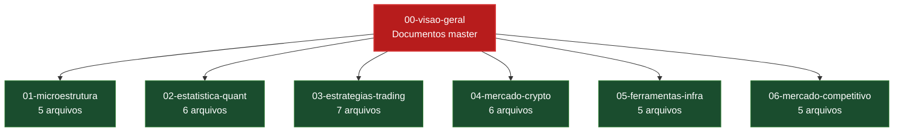

# Pesquisas: Mapa do Conhecimento do crypto-correl-bot

**Data criacao:** 2026-07-15
**Total:** 6 grupos de pesquisa + 4 documentos master + 1 dashboard interativo
**Idioma:** Portugues (pt-BR)

## Como ler

1. Comece por `00-visao-geral/` (visao geral do sistema + mercado + explicacao para criancas + dashboard HTML).
2. Depois va para o grupo que mais te interessa (microestrutura, estatistica, estrategias, etc).
3. Cada arquivo segue a mesma estrutura: TL;DR, explicacao para criancas, tecnico, mercado 2026, ferramentas, projeto, referencias.

## Estrutura

```
docs/pesquisas/
├── README.md                              <- este arquivo
├── 00-visao-geral/
│   ├── SISTEMA-COMPLETO.md                <- organograma do sistema (Mermaid + ASCII)
│   ├── MERCADO-COMPLETO.md                <- panorama do mercado 2026 (grafo Mermaid)
│   ├── PARA-CRIANCAS.md                   <- explicacao para qualquer pessoa
│   └── mapa-sistema-mercado.html          <- dashboard interativo (vis-network)
├── 01-microestrutura/
│   ├── order-book-depth-microprice.md
│   ├── order-flow-cvd-delta.md
│   ├── volume-profile-vpvr.md
│   ├── kyle-lambda-amihud-vpin.md
│   └── taker-flow-wick-analysis.md
├── 02-estatistica-quant/
│   ├── returns-correlacao-rolling.md
│   ├── cointegracao-stat-arb-pairs-trading.md
│   ├── hurst-exponent-half-life-mean-reversion.md
│   ├── garch-volatilidade-condicional.md
│   ├── regime-detection-hmm-entropy-ruptures.md
│   └── var-cvar-drawdowns-risk-metrics.md
├── 03-estrategias-trading/
│   ├── mean-reversion-correlacao.md
│   ├── momentum-trend-following.md
│   ├── vwap-reversion.md
│   ├── funding-rate-arbitrage.md
│   ├── liquidity-sweep-ict-smc.md
│   ├── price-action-breakout-pullback.md
│   └── delta-neutral-estrategias.md
├── 04-mercado-crypto/
│   ├── perpetual-futures-funding-oi-liquidations.md
│   ├── btc-dominancia-rotacao-setorial.md
│   ├── fear-greed-sentimento-onchain.md
│   ├── kill-zones-sessoes-horarios.md
│   ├── lead-lag-granger-causalidade.md
│   └── on-chain-analytics-defi.md
├── 05-ferramentas-infra/
│   ├── binance-vision-ccxt-python-binance.md
│   ├── networkx-pyvis-graph-tool-igraph.md
│   ├── parquet-arrow-armazenamento-timeseries.md
│   ├── backtest-frameworks-vectorbt-backtrader-jesse-nautilus.md
│   └── trading-bot-frameworks-freqtrade-hummingbot-jesse.md
└── 06-mercado-competitivo/
    ├── bots-comerciais-3commmas-cryptohopper-pionex.md
    ├── plataformas-quant-coinglass-laevitas-velo.md
    ├── apis-dados-2026-cripto-trading.md
    ├── ia-trading-llm-agentes-2026.md
    └── defi-onchain-analytics-dune-nansen.md
```

## Mapa visual (Mermaid)



## Ordem de leitura recomendada

### Para entender o sistema rapidamente (1 hora)
1. `00-visao-geral/PARA-CRIANCAS.md` (15 min)
2. `00-visao-geral/SISTEMA-COMPLETO.md` (20 min, foco no organograma)
3. `00-visao-geral/MERCADO-COMPLETO.md` (20 min, foco no mapa do ecossistema)

### Para profundar em estrategias (3-4 horas)
1. `03-estrategias-trading/mean-reversion-correlacao.md`
2. `02-estatistica-quant/returns-correlacao-rolling.md`
3. `02-estatistica-quant/cointegracao-stat-arb-pairs-trading.md`
4. `02-estatistica-quant/regime-detection-hmm-entropy-ruptures.md`
5. `03-estrategias-trading/funding-rate-arbitrage.md`
6. `03-estrategias-trading/liquidity-sweep-ict-smc.md`

### Para profundar em microestrutura (2-3 horas)
1. `01-microestrutura/order-book-depth-microprice.md`
2. `01-microestrutura/order-flow-cvd-delta.md`
3. `01-microestrutura/volume-profile-vpvr.md`
4. `01-microestrutura/kyle-lambda-amihud-vpin.md`

### Para decisao de stack (2 horas)
1. `05-ferramentas-infra/binance-vision-ccxt-python-binance.md`
2. `05-ferramentas-infra/backtest-frameworks-vectorbt-backtrader-jesse-nautilus.md`
3. `05-ferramentas-infra/trading-bot-frameworks-freqtrade-hummingbot-jesse.md`
4. `06-mercado-competitivo/apis-dados-2026-cripto-trading.md`

### Para posicionar o produto no mercado (1 hora)
1. `00-visao-geral/MERCADO-COMPLETO.md`
2. `06-mercado-competitivo/bots-comerciais-3commmas-cryptohopper-pionex.md`
3. `06-mercado-competitivo/plataformas-quant-coinglass-laevitas-velo.md`
4. `06-mercado-competitivo/ia-trading-llm-agentes-2026.md`

## Dashboard interativo

Abrir no navegador:
```bash
xdg-open /home/lucas/Projetos/crypto-correl-bot/docs/pesquisas/00-visao-geral/mapa-sistema-mercado.html
```

O dashboard mostra:
- Mapa de forca (force-directed) com nodes do sistema + nodes do mercado
- Filtros por categoria (data, analysis, strategy, backtest, viz, bot, exchange, retail, quant, onchain)
- Click em node abre painel lateral com detalhes
- Busca por nome

## Status de geracao

Esta pasta e gerada por 6 subagentes paralelos + documentos master escritos pelo agente principal. Caso algum arquivo esteja faltante ou incompleto, ele pode ser regerado individualmente rodando:

```bash
# Exemplo: regerar so o documento de order flow
# (instrucoes dependem do setup do Devin CLI)
```

## Atualizacoes

- **2026-07-15**: criacao inicial da estrutura, 4 documentos master, dispatch de 6 subagentes para 34 topicos.

## Regras seguidas na escrita

- Linguagem: Portugues (pt-BR)
- Sem travessao (em-dash)
- Estrutura padrao por arquivo: TL;DR, criancas, tecnico, mercado, ferramentas, projeto, referencias
- Tom: profissional, denso, sem jargao corporativo
- Numeros e URLs: so se confirmados por web_search ou por dados do projeto
